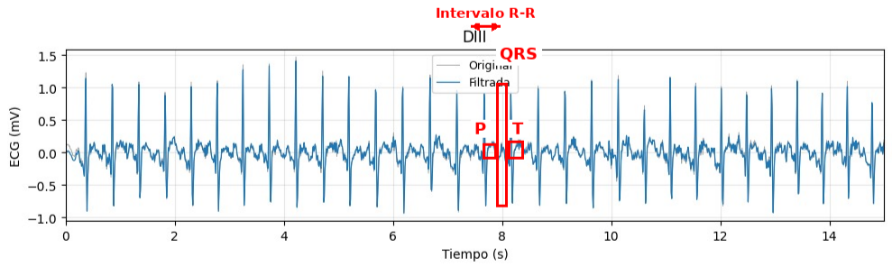
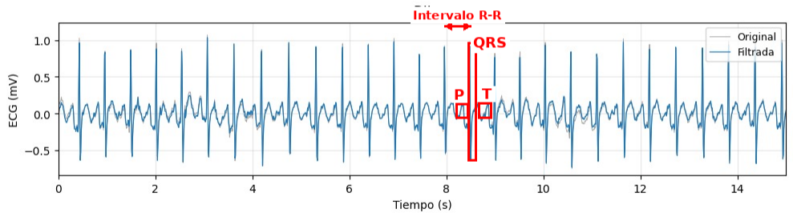

 # Informe 4  - Aplicación del BiTalino en ECG
## **Objetivos**
* Adquirir señales biomédicas de ECG en derivadas bipolares (DI, DII, DIII).
* Hacer una correcta configuración de BiTalino.
* Extraer la información de las señales ECG del software OpenSignals (r)evolution

## **Materiales y equipos** 

|  **Modelo**  | **Descripción** | **Cantidad** |
|:------------:|:---------------:|:------------:|
| (R)EVOLUTION |   Kit BITalino  |       1      |
|       -      |      Laptop     |       1      |

## **Procedimiento**
## Preparación del sistema y colocación de los electrodos
Al incio el labortorio se preparó el sistema BITalino utilizando el sensor de electrocardiografía (ECG) y tres electrodos adhesivos de Ag/AgCl. El sensor ECG cuenta con dos cables de medición, correspondientes a IN+ e IN−, y un cable de referencia (REF). Para el montaje empleado, estos cables correspondieron al cable rojo (IN+), negro (IN−) y blanco (REF).
Los electrodos fueron colocados en zonas con baja actividad muscular específicamente sobre las regiones correspondientes a ambas clavículas y la cresta ilíaca izquierda, de esta forma disminuye la interferencia producida por la actividad muscular y los artefactos asociados al movimiento durante la adquisición del ECG.

Figura 1. Ubicación de los electrodos y configuración de las derivaciones I, II y III de Einthoven.

## Configuración de las derivaciones de Einthoven
Una vez colocados los tres electrodos en las posiciones corporales correspondientes, se configuró el sensor para realizar las adquisiciones mediante las tres derivaciones de Einthoven: DI, DII y DIII. Estas derivaciones permiten registrar la actividad eléctrica cardíaca desde diferentes orientaciones en el plano frontal, ya que cada una mide una diferencia de potencial entre dos puntos determinados del cuerpo.

Para obtener cada derivación, se modificó la conexión de los cables IN+, IN− y REF entre los tres electrodos . La configuración utilizada se presenta en la siguiente tabla:

Tabla 1. Configuración de los electrodos y conexiones de los cables para las derivaciones DI, DII y DIII.

| **Derivación** | **Electrodo positivo (IN+)** | **Electrodo negativo (IN−)** | **Electrodo de referencia (REF)** | **Diferencia de potencial registrada**         |
| -------------- | ---------------------------- | ---------------------------- | --------------------------------- | ---------------------------------------------- |
| **DI**         | Clavícula izquierda          | Clavícula derecha            | Cresta ilíaca izquierda           | Entre el brazo izquierdo y el brazo derecho    |
| **DII**        | Cresta ilíaca izquierda      | Clavícula derecha            | Clavícula izquierda               | Entre la pierna izquierda y el brazo derecho   |
| **DIII**       | Cresta ilíaca izquierda      | Clavícula izquierda          | Clavícula derecha                 | Entre la pierna izquierda y el brazo izquierdo |

## Adquisición de la lectura basal
Una vez realizada la configuración inicial del sistema, se inició la adquisición de la señal mediante el software OpenSignals (r)evolution. Primero se obtuvo una lectura basal durante aproximadamente 30 segundos, manteniendo al participante en reposo y con respiración normal. Durante esta etapa se procuró mantener el cuerpo estable para obtener una señal con el menor nivel posible de ruido y utilizarla como referencia para las condiciones posteriores.
La lectura basal se realizó para las tres derivaciones de Einthoven, registrándose sucesivamente DI, DII y DIII.

Figura 2. Adquisición de la señal ECG durante la lectura basal en reposo.

## Adquisición durante hiperventilación
Posteriormente, se realizó la prueba de hiperventilación. Para esta etapa, el participante modificó voluntariamente su patrón respiratorio acelerando la inhalación, mantenimiento y exhalación, durante aproximadamente 30 segundos.

La señal electrocardiográfica se registró nuevamente mediante las derivaciones DI, DII y DIII. Entre las adquisiciones correspondientes a cada derivación se estableció un período de reposo de aproximadamente 1 minuto, con el propósito de permitir la recuperación del participante

Figura 3. Adquisición de la señal ECG durante la prueba de hiperventilación.

## Adquisición durante hipoventilación
En la prueba de hipoventilación el participante mantuvo la respiración durante el mayor tiempo posible y posteriormente realizó la exhalación indicada, tras lo cual se procedió a cuantificar el registro obtenido. Se las tres derivaciones de Einthoven teniendo 1 minuto y 30 segundos entre cada una de ellas 

Figura 4. Adquisición de la señal ECG durante la prueba de hipoventilación.

## Adquisición posterior a la actividad aeróbica
Finalmente, se realizó una actividad aeróbica durante aproximadamente 5 a 10 minutos, con el objetivo de generar una condición de esfuerzo físico. Al finalizar la actividad, se realizó rápidamente la adquisición de la señal electrocardiográfica para registrar la respuesta del organismo inmediatamente después del esfuerzo.
La señal se obtuvo nuevamente mediante las derivaciones DI, DII y DIII, estableciendo un intervalo aproximado de 30 segundos entre las adquisiciones de cada derivación.

Figura 5. Realización de la actividad aeróbica previa a la adquisición de la señal ECG.

## **Resultados**
Adquisición de la señal:
En esta etapa, Renzo se encuentra sentado en posición de reposo mientras los electrodos se encuentran conectados al cuerpo y al dispositivo BITalino. El compañero encargado de la medición verifica la conexión de los electrodos y mantiene el sistema conectado para registrar la actividad eléctrica cardíaca. La señal obtenida posteriormente puede ser visualizada y analizada para evaluar el comportamiento del ECG bajo las diferentes condiciones de estudio.
### Fotos de conexión usada.

### Video de las señales
     
|                 **Modelo**                 | **Video** |
|:------------------------------------------:|:---------:|
| **Estado Basal**                |https://github.com/user-attachments/assets/4c234303-b353-4a03-8289-7dc64226a08e|
| **Hiperventilación** |https://github.com/user-attachments/assets/aa3f9aa3-8d5c-40ec-a191-4021a1ad339a|
| **Hipoventilación**               |https://github.com/user-attachments/assets/0ccb0023-1efc-40f2-aaca-39290f64e354|
| **Actividad física**       |https://github.com/user-attachments/assets/b020044e-0b05-47d3-8ba2-7904e104d2bc|

### Ploteo de la señal en Python
**Señal original y filtrada::** 
  * Reposo
    
    En un intervalo de tiempo de 15 segundos:

  

  * Hiperventilación *
    
    En un intervalo de tiempo de 15 segundos:

    
  * Hipoventilación
    
    En un intervalo de tiempo de 15 segundos:

    

  * Actividad aeróbica
    
    En un intervalo de tiempo de 15 segundos:
    

### Ploteo de la señal en OpenSignals

**Señal cruda:**

  * Reposo
    
    En un intervalo de tiempo de 15 segundos:

    Derivada 1:
    

    Derivada 2:
    

    Derivada 3:
    

    
  * Hiperventilación
    
    En un intervalo de tiempo de 15 segundos:
    Derivada 1:
    

    Derivada 2:
    

    Derivada 3:
    

    

    
 
    
  * Hipoventilación
    
    En un intervalo de tiempo de 15 segundos:
    Derivada 1:
    

    Derivada 2:
    

    Derivada 3:
    

    

    
 

  * Actividad aeróbica
    Derivada 1:
    

    Derivada 2:
    

    Derivada 3:
    

    En un intervalo de tiempo de 15 segundos:
    
    

    
 

### Archivos

* [Programa de ploteo (Jupyter Notebook)](https://github.com/Itzmiyeko/GRUPO8-ISB-2026-II/blob/main/Laboratorios/Lab_04/analisis_bitalino_ECG.ipynb)

  
## Resumen y explicación de la señal

Las señales ECG fueron extraídas del módulo BiTalino, los cuales posteriormente de su adquisición, se analizo en Python. Como primer paso se extrae la señal cruda en valores de mV. Posteriormente se crea funciones de filtros para que la señal ECG se pueda observar de manera más nitida las señales y para eliminar también el ruido y las interferencias que contaminan la señal eléctrica del corazón, permitiendo obtener un trazo limpio y fácil de interpretar.

Los filtros que se emplearon fueron los siguientes:
1. Filtro pasa-altos (0.5 Hz) — para eliminar el baseline wander (deriva de la línea base), causado por la respiración, el movimiento de electrodos y el sudor.
2. Filtro pasa-bajos (40 Hz para monitoreo) — para eliminar ruido de alta frecuencia, principalmente interferencia muscular (EMG) captada por los mismos electrodos.
3. Filtro notch (rechazo de banda) de 60 Hz — para eliminar la interferencia de la red eléctrica con un factor de calidad de 30, para que ancho de banda de atenuación sea corta (2 Hz).

A continuación, se presenta el análisis las actividades realizadas en la prueba:

### 1. Estado Basal (Reposo)

Figura 6. Señal de Reposo DII con intervalos, segmentos y ondas

En las gráficas mostradas en resultados se puede observar que las tres derivaciones presentan ondas P y T complejos QRS claramente definidos siendo DII y DIII las que permiten visualizar mejor la morfología del ECG debido a la orientación posicional con el corazón.

La señal registrada en condición de reposo, correspondiente a la derivación DII, presenta una morfología característica y fácilmente reconocible de un electrocardiograma normal, en la cual pueden identificarse con claridad los tres componentes fundamentales de cada ciclo cardíaco: 
- La onda P, que refleja la despolarización auricular y aparece como una deflexión pequeña y suave antes de cada complejo
- Complejo QRS, correspondiente a la despolarización ventricular, que se observa como el pico de mayor amplitud de la señal, con una excursión que va desde aproximadamente -0.6 mV hasta 1.0 mV; y - La onda T, ligeramente posterior al complejo QRS, que representa la repolarización ventricular y se manifiesta como una onda de menor amplitud y mayor duración que la onda P. 

La separación entre picos R consecutivos (intervalo R-R) se mantiene notablemente constante a lo largo de toda la ventana de 15 segundos analizada, con un valor aproximado de 0.6 segundos entre latidos, lo que genera en total 25 picos en la DII que corresponde a una **frecuencia cardíaca ~ 100 lpm**. Este valor se encuentra dentro del rango fisiológico normal de reposo, aunque en el extremo superior de dicho rango, lo cual podría explicarse por factores como el nerviosismo propio de la medición experimental o la posición del sujeto durante el registro. 
Es importante destacar que la señal filtrada prácticamente se superpone a la señal original en toda la ventana temporal, evidenciando que el registro presentaba un nivel de ruido basal muy bajo en la DII, consistente con la ausencia de movimiento del sujeto y con un buen contacto entre los electrodos y la piel.

### 2. Hiperventilación

Figura 6. Señal de hiperventilación DIII con intervalos, segmentos y ondas

En la gráfica de hiperventilación se observa que las tres derivaciones presentan complejos QRS claramente definidos, siendo DII y DIII las que permiten visualizar mejor la morfología del ECG. La derivación DI presenta una amplitud mucho menor y una mayor presencia de ruido. Estas diferencias se deben a que cada derivación registra la actividad eléctrica del corazón desde una orientación diferente, por lo que la misma actividad cardíaca puede presentar distintas amplitudes en DI, DII y DIII.

La señal filtrada sigue muy de cerca a la señal original, pero presenta una apariencia más limpia. Esto permite distinguir mejor los complejos cardíacos. Las pequeñas fluctuaciones que permanecen en la señal pueden estar relacionadas con ruido de adquisición, actividad muscular o movimientos durante la respiración.

En DII, tomando dos ondas R consecutivas de la gráfica, el intervalo R-R es aproximadamente:
R−R ≈ 0.53s
Por lo que la frecuencia cardíaca aproximada sería:
**FC ≈ 60/0.53 ≈ 113 lpm**

Esto corresponde a una señal con latidos relativamente frecuentes durante el registro de hiperventilación.

El aumento de la frecuencia respiratoria durante la hiperventilación puede influir en la frecuencia cardíaca debido a la relación entre la respiración y el sistema nervioso autónomo. Por ello, pueden presentarse variaciones en los intervalos R-R durante el registro. Asimismo, al realizar respiraciones más rápidas y profundas, aumenta el movimiento del tórax, lo que puede generar pequeñas variaciones de la línea de base y artefactos en la señal ECG.

En esta condición, el complejo QRS es el componente más fácil de identificar debido a su mayor amplitud. La onda P se encuentra antes del QRS y la onda T después de este, aunque presentan menor amplitud y pueden ser menos evidentes en algunas partes de la señal.

### 3.Hipoventilación

Figura 7. Señal de hipoventilación DII con intervalos, segmentos y ondas

En la gráfica de hipoventilación también se identifican los componentes principales del ECG. Nuevamente, DII y DIII presentan una morfología más evidente, mientras que DI muestra una señal de menor amplitud. Esto se relaciona con la orientación de cada derivación respecto a la actividad eléctrica cardíaca.

Los complejos QRS aparecen de forma repetitiva y relativamente regular. La señal filtrada conserva la forma general de la señal original, reduciendo parte de las fluctuaciones y del ruido, por lo que permite identificar con mayor facilidad los complejos cardíacos.

En DII, el intervalo R-R observado es aproximadamente:
R−R ≈ 0.55s
y la frecuencia cardíaca estimada:
**FC ≈ 60/0.55 ≈ 109 lpm**

Por lo tanto, durante el registro de hipoventilación se observa una frecuencia cardíaca aproximada de 109 lpm.

La hipoventilación o contención de la respiración modifica temporalmente el patrón respiratorio y el intercambio de gases. Esto puede generar una respuesta del organismo que influya en la actividad del sistema nervioso autónomo y como consecuencia, producir variaciones en la frecuencia cardíaca y en el intervalo R-R. Además, cuando se vuelve a respirar después de la contención, pueden presentarse cambios transitorios en la señal.

A diferencia de la hiperventilación, durante la contención de la respiración existe inicialmente menos movimiento del tórax, por lo que la señal puede presentar menos variaciones producidas por la respiración. Sin embargo, todavía pueden observarse pequeñas variaciones debido al movimiento del cuerpo, los electrodos y el ruido de la medición.

### 4. Actividad aeróbica

Figura. Señal de actividad aeróbica DII con intervalos, segmentos y ondas

La señal obtenida durante la condición de actividad aeróbica muestra cambios morfológicos y de ritmo claramente asociados a la respuesta fisiológica al ejercicio. 

El intervalo R-R se reduce considerablemente respecto al registro de reposo, situándose en aproximadamente 0.42 segundos, generando un total 35 picos en 15 segundos lo que se traduce en una **FC ~ 140 lpm**, reflejando la taquicardia sinusal esperada como respuesta simpática al esfuerzo físico.

La morfología de la onda P se vuelve considerablemente más difícil de distinguir del ruido de fondo, dado que su amplitud es intrínsecamente menor que la del complejo QRS y se ve más afectada por las variaciones de la línea de base. 

El complejo QRS, por su parte, sigue siendo identificable en todos los ciclos, pero su amplitud deja de ser constante: se observan variaciones notorias entre un latido y otro, oscilando entre aproximadamente 0.7 mV y 1.2 mV, lo cual no corresponde a una variabilidad fisiológica real del corazón, sino a artefactos de movimiento generados por el desplazamiento de los electrodos sobre la piel durante la actividad física, que modifican momentáneamente la impedancia de contacto. 

Debido a la actividad del ejercicio, la onda P y la onda T aparecen seguidos con un acercamiento demasiado considerable. Este desajuste se debe a que el espacio total de cada latido (el R-R) se reduce mucho, el espacio que ocupa la onda T dentro de ese latido se reduce menos, por lo que la onda T "invade" una porción proporcionalmente mayor del ciclo. Al mismo tiempo, el llenado diastólico (el período entre el final de un latido y el inicio de la despolarización auricular del siguiente) también se acorta con la taquicardia, lo que hace que la siguiente onda P aparezca más pronto después de la onda T anterior. La combinación de ambos efectos (una onda T que ocupa relativamente más espacio y una onda P que llega relativamente antes) provoca que ambas terminen visualmente muy próximas entre sí, e incluso pueden llegar a superponerse parcialmente. Este fenómeno es conocido clínicamente como **"P sobre T" (P-on-T)** y ese suele encontrar en registros de taquicardia sinusal fisiológica como la inducida por ejercicio, sin que esto implique necesariamente una alteración patológica.

Asimismo, se observa una deriva de la línea base (baseline wander) más pronunciada e irregular que en los registros anteriores, atribuible tanto al aumento de la frecuencia respiratoria como al movimiento del tórax durante el ejercicio. En este caso, la señal filtrada y la señal original tampoco muestran una diferencia visual marcada, lo cual sugiere que el filtro pasa-banda utilizado no resulta igual de efectivo para atenuar el tipo de artefacto dominante en esta condición, que corresponde principalmente a interferencia de movimiento en un rango de frecuencias que se superpone parcialmente con el de la propia señal cardíaca.

## Preguntas de la guía del Bitalino ECG

P1. ¿Cuáles son los tipos de fuentes de ruido más típicos que afectan al ECG?

Las señales de ECG pueden verse afectadas por diferentes tipos de ruido. Entre los más frecuentes se encuentran la interferencia eléctrica de la red de 50/60 Hz, los artefactos producidos por el movimiento del paciente o de los electrodos y la actividad eléctrica de los músculos cercanos. También pueden presentarse variaciones lentas de la línea de base debido a la respiración o a movimientos corporales. Asimismo, un contacto inadecuado entre los electrodos y la piel puede generar alteraciones en la señal debido a cambios en la impedancia. Estos factores pueden provocar oscilaciones, distorsiones o señales adicionales que dificultan la correcta identificación de las ondas del ECG.

P2. ¿Por qué el cambio en la posición de los sensores (derivaciones I-III) modifica las componentes de la señal de ECG? ¿Cómo cambian estas componentes?

El cambio de posición de los electrodos modifica la señal registrada porque cada derivación permite observar la actividad eléctrica del corazón desde una dirección diferente. Las derivaciones I, II y III corresponden a diferentes combinaciones de electrodos ubicados en las extremidades y forman el denominado triángulo de Einthoven. Como la actividad eléctrica cardíaca tiene una dirección y magnitud, cada derivación registra una proyección diferente del vector eléctrico cardíaco sobre su propio eje. Por eso al cambiar de derivación puede variar la morfología de las señales (ondas T, ondas P, complejo QRS), pero la frecuencia cardíaca y el intervalo temporal entre los latidos no deberían cambiar significativamente únicamente por cambiar de derivación, porque el corazón sigue produciendo los mismos ciclos eléctricos; lo que cambia es la perspectiva desde la cual se registran.

P3. Describe si existen diferencias significativas en la señal al registrarla desde distintas ubicaciones del cuerpo (por ejemplo, muñeca / clavícula / pecho). ¿Cuál podría ser la causa? ¿Esperabas esos cambios en la señal? Guarda un segmento de señal de cada una para visualizar las diferencias.

Sí pueden presentarse diferencias en la señal de ECG cuando los electrodos se colocan en distintas partes del cuerpo. Esto se debe principalmente a que la ubicación y orientación de los electrodos determinan la dirección y la magnitud de la actividad eléctrica cardíaca que puede ser registrada.

Además, factores como la distancia entre los electrodos y el corazón, la impedancia de contacto con la piel, el grosor de los tejidos y la actividad muscular de la zona pueden modificar la señal obtenida. Por esta razón, es esperable encontrar diferencias en la amplitud, polaridad, morfología y estabilidad de la señal al realizar registros desde la muñeca, clavícula o pecho.

P4. Es bien sabido que los sistemas cardíaco y respiratorio están profundamente interconectados. ¿Esperas que los diferentes tipos de respiración (por ejemplo, más rápida o más profunda) influyan en las señales de ECG? 

Los diferentes patrones respiratorios pueden producir cambios en la señal de ECG. La respiración puede generar variaciones en la frecuencia cardíaca, fenómeno conocido como arritmia sinusal respiratoria, en el que la frecuencia cardíaca suele aumentar durante la inspiración y disminuir durante la espiración.

Además, una respiración profunda puede producir movimientos del tórax que modifican ligeramente la posición del corazón respecto a los electrodos. Como consecuencia, pueden observarse variaciones en la amplitud de las ondas, desplazamientos de la línea de base y cambios en los intervalos entre los complejos QRS. Una respiración rápida también puede aumentar los artefactos asociados al movimiento y dificultar la identificación de las diferentes componentes del ECG.

P5. En la Home-Guide #1 (guía anterior sobre EMG) viste que distintas cantidades de fuerza producidas en el músculo generaban señales con diferentes amplitudes. ¿Cómo influye el movimiento en tu señal de ECG?

El movimiento puede afectar considerablemente la señal de ECG y producir artefactos de movimiento.
Cuando una persona se mueve, pueden cambiar tanto la posición de los electrodos como el contacto entre estos y la piel. Además, los músculos que participan en el movimiento generan actividad eléctrica que puede ser captada por los electrodos y mezclarse con la actividad cardíaca. 

Por lo que, pueden aparecer fluctuaciones de la línea de base, cambios repentinos en la amplitud y señales de alta frecuencia que dificultan la identificación de las ondas P, QRS y T. Por lo tanto, una señal registrada durante el movimiento generalmente presenta mayor cantidad de ruido que una obtenida cuando la persona permanece en reposo.

P6. Según tu conocimiento, ¿cómo se pueden detectar la bradicardia y la taquicardia en la señal de ECG?

La bradicardia y la taquicardia pueden identificarse mediante el cálculo de la frecuencia cardíaca a partir de los intervalos R-R del ECG. Para ello, primero se identifican las ondas R y se determina el tiempo transcurrido entre dos ondas R consecutivas.

La frecuencia cardíaca puede calcularse mediante:
**FC= 60 / RR**
donde
FC: frecuencia cardíaca en latidos por minutos
RR: intervalo entre dos ondas R consecutivas, expresado en segundos.

En términos generales, en adultos en reposo, una frecuencia cardíaca persistentemente menor de 60 LPM se denomina bradicardia y una mayor de 100 LPM se denomina taquicardia.
