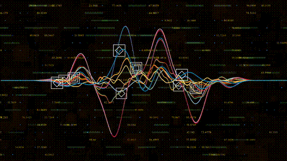

# Introducción a Señales Biomédicas 2026-II 

	

## Introducción 🌟

Bienvenido a nuestros repositorio del curso de Introducción a Señales Biomédicas 2026-II. En este espacio se documenta nuestro proceso de aprendizaje en el análisis y procesamiento de señales y sistemas.

El objetivo aquí no es solo resolver ecuaciones, sino también mostrar cómo el modelamiento matemática y la simulación de circuitos se aplican al mundo real.

## ¿Quiénes somos? 👩‍💻

|Foto | Integrantes | Descripción |Contacto|
| ----- | :---- | :------ |:---|
||**ARIANA CRISTINA LOZANO REGUERA** |  Estudiante de 7mo ciclo de ingeniería biomédica interesada en el campo de la biomecánica | ariana.lozano@upch.pe|
||**EMMA LISBETH RIVERA JARA** |  Estudiante de Ingeniería Biomédica de 7mo ciclo interesado en Señales e imágenes biomédica y Biomecánica.| emma.rivera@upch.pe
| |**RENZO WILLIAM LUNA ALIAGA** |  Estudiante de 7mo ciclo de la carrera de ingeniería biomédica. Interesado en Ingeniería de Tejidos y en Señales e imágenes biomédicas. ||
| | **ITZEL MIYEKO DE LA CRUZ GÁLVEZ** |  Estudiante de 7mo ciclo de la carrera de ingeniería biomédica. Interesado en Ingeniería Clínica e investigación. ||
| |**VIVIANA NINOSKA RIVERA GUILLÉN**|  Estudiante de 7mo-8vo ciclo de ingeniería biomédica interesada en Ingeniería de Tejidos y Biomecánica. |viviana.rivera@upch.pe|
